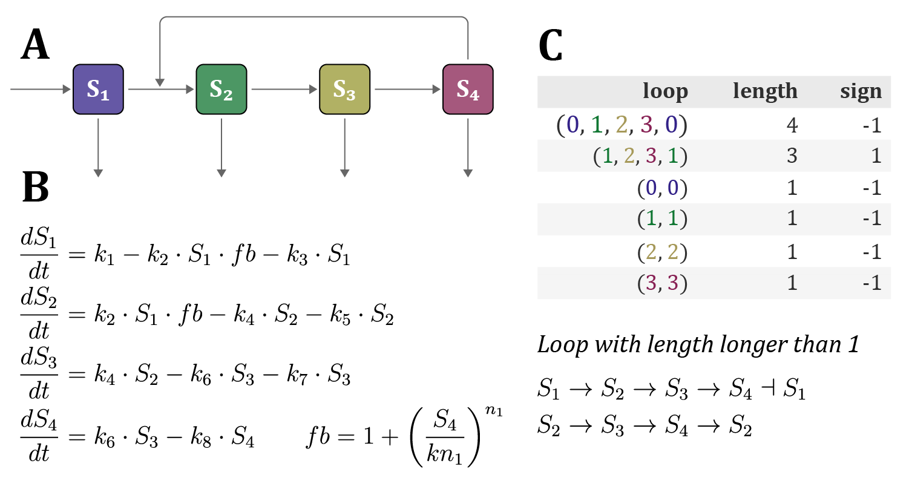

# LoopDetect_for_Matlab

LoopDetect_for_Matlab is a MATLAB package for detecting feedback loops in ordinary differential equation (ODE) models.

In this package, a feedback loop, also called a cycle or circuit, is defined as a path from one node to itself without visiting any other node more than once. Nodes correspond to variables of the ODE system. For each detected loop, the package reports the loop length and whether the loop is positive or negative.

An upper limit on the number of returned feedback loops can be specified to reduce runtime. Runtime scales with the number of detected feedback loops.

LoopDetect_for_Matlab was developed using MATLAB R2019b. It only uses base MATLAB functions and does not require additional MATLAB toolboxes.

## Quickstart

Download and unzip the repository. Open MATLAB and either navigate to the downloaded folder or add the folder to the MATLAB path.

The following example reports up to 10 feedback loops for an ODE system defined by the function `func_POSm4`, evaluated at the variable values `s_star`. In this example, all variable values are set to 1.

The ODE function passed to `find_loops_vset` must depend only on the variable values. Any additional parameters, including time, must be fixed beforehand.

```matlab
s_star = [1, 1, 1, 1]';

klin = ones(1, 8);
knonlin = [2.5, 3];
t = 0;

loop_list = find_loops_vset(@(x) func_POSm4(t, x, klin, knonlin), s_star, 10);

% Return the full list of detected feedback loops, up to 10
loop_list{1}

% Return only the first loop
first_loop = loop_list{1}.loop{1}
```



Example workflow: POSm4 model scheme, feedback loops are detected and classified by length and sign, and the resulting loop list can be inspected.

## Workflow and documentation

A possible workflow and useful commands are described in detail here:

- [Workflow HTML](https://dilis-lab.github.io/loopdetect_for_matlab/workflow_LoopDetect_Matlab.html)
- [Workflow PDF](https://docs.google.com/viewer?url=https://raw.githubusercontent.com/DILiS-lab/loopdetect_for_matlab/master/workflow_LoopDetect_Matlab.pdf)

The workflow is based on the live script `workflow_LoopDetect_Matlab.m`.

Each function file contains a description and usage examples, which can be accessed using MATLAB's `help` function.

The `.m` files are also documented in the folder `function_documentation_by_m2html`. The generated documentation can be browsed here:

- [Function documentation](https://kabaum.gitlab.io/fbldetect_for_matlab/)

The documentation was generated using [m2html](https://github.com/gllmflndn/m2html).

## License

All code is licensed under the GNU GPLv3.

LoopDetect_for_Matlab  
Copyright (C) 2020 Katharina Baum.


